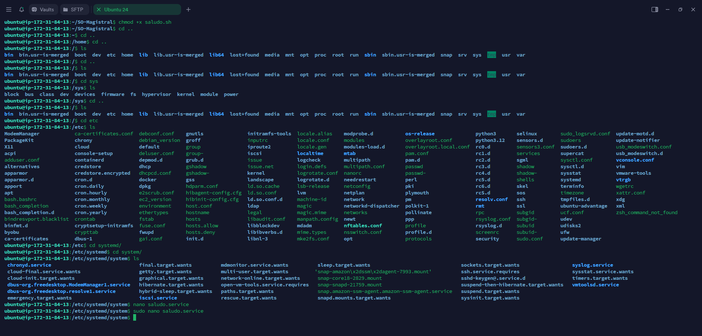
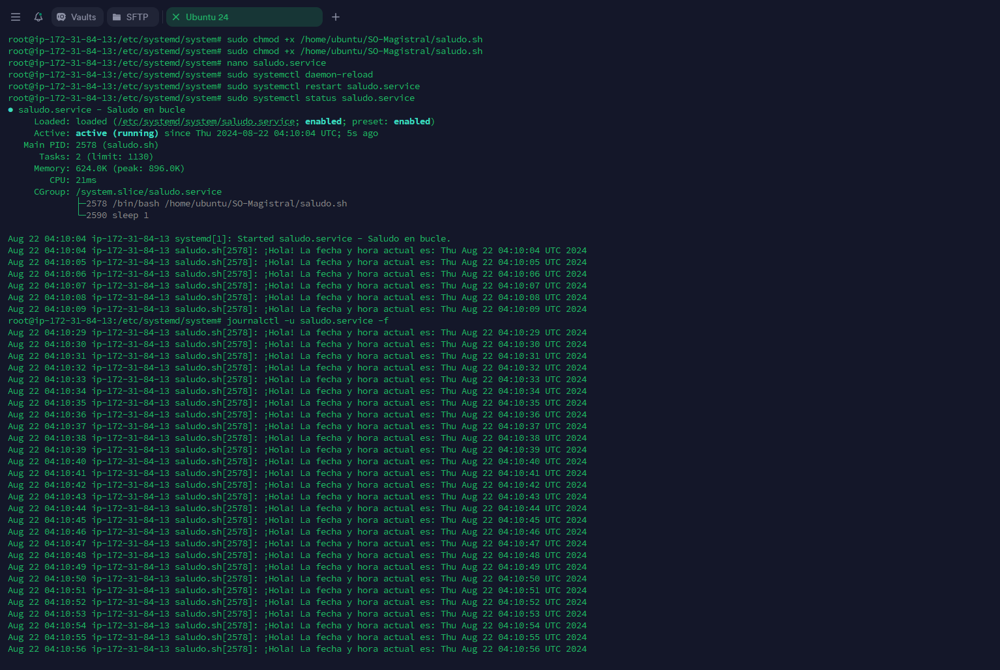

# Systemd Unit
## Creación del script

```shell
#!/bin/bash
while true
do
    echo "¡Hola! La fecha y hora actual es: $(date)"
    sleep 1
done
```
## Permisos del script

```shell
    chmod +x saludo.sh
```

## Creación del archivo de servicio

```shell
[Unit]
Description=Saludo en bucle
After=network.target

[Service]
ExecStart=/home/ubuntu/SO-Magistral/saludo.sh
Restart=always
User=ubuntu
WorkingDirectory=/home/ubuntu/SO-Magistral/

[Install]
WantedBy=multi-user.target
```

## Habilitación del servicio

```shell
sudo su
systemctl daemon-reload
systemctl enable saludo.service
systemctl start saludo.service
```

## Verificación del servicio

```shell
systemctl status saludo.service
```

## Verificación de los logs
    
```shell
journalctl -u saludo.service
```

## Capturas del proceso

### Creación del service


### Habilitación del service


### Verificación del service y revicion de logs


### Verificación de los recursos


## DESHABILITAR Y ELIMINAR EL SERVICIO

## Detención del servicio

```shell
systemctl stop saludo.service
```

## Deshabilitación del servicio

```shell
systemctl disable saludo.service
```

## Eliminación del servicio

```shell
rm /etc/systemd/system/saludo.service
systemctl daemon-reload
```

## Verificación de la eliminación del servicio

```shell
systemctl status saludo.service
```

## Verificación de la eliminación del archivo

```shell
ls /etc/systemd/system/saludo.service
```

## Verificación de la eliminación del archivo de log

```shell
ls /var/log/saludo.log
```