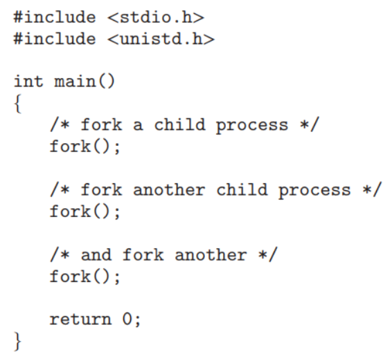
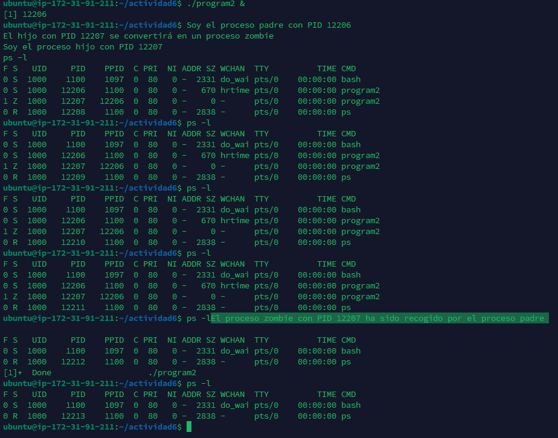
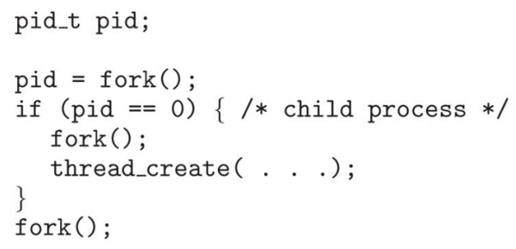
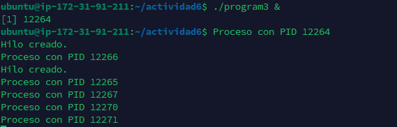

# Actividad 6 – Procesos e Hilos

## 1. ¿Incluyendo el proceso inicial, cuantos procesos son creados por el siguiente programa?



```Bash 
    -- R// Son creados 8 procesos, 1 padre y 7 hijos .
```


## 2. Utilizando un sistema Linux, escriba un programa en C que cree un proceso hijo (fork) que finalmente se convierta en un proceso zombie. Este proceso zombie debe permanecer en el sistema durante al menos 60 segundos.
Los estados del proceso se pueden obtener del comando: ps -l

```c
#include <sys/types.h>
#include <unistd.h>
#include <stdio.h>
#include <pthread.h>

void* thread_function(void* arg) {
    // thread code here
    return NULL;
}

int main() {
    pid_t pid;
    pid = fork();
    if (pid < 0) {
        // handle fork error
        perror("fork");
        return 1;
    } else if (pid == 0) {
        // child process
        pthread_t thread;
        int ret = pthread_create(&thread, NULL, thread_function, NULL);
        if (ret != 0) {
            perror("pthread_create");
            return 1;
        }
        pthread_join(thread, NULL);
    } else {
       
    }
    return 0;
}
```
 

<br>
Consola donde se muestra como muere el proceso.


## 3. Usando el siguiente código como referencia, completar el programa para que sea ejecutable y responder las siguientes preguntas:




Codigo terminado 
<br>

``` c
#include <stdio.h>
#include <unistd.h>
#include <pthread.h>

void* thread_function(void* arg) {
    printf("Hilo creado.\n");
    pthread_exit(NULL);
}

int main() {
    pid_t pid;
    pthread_t thread;

    pid = fork();
    if (pid == 0) {
        fork();
        pthread_create(&thread, NULL, thread_function, NULL);
        pthread_join(thread, NULL);
    }

    fork();
    printf("Proceso con PID %d\n", getpid());
    return 0;
}
```

<br>
Consola



### ¿Cuántos procesos únicos son creados?

```shell
  R//  Son crados 6 procesos unicos, 1 padre y 5 hijo.
```

### ¿Cuántos hilos únicos son creados?
```shell
  R//  Se genera 2 unico hilos
```
