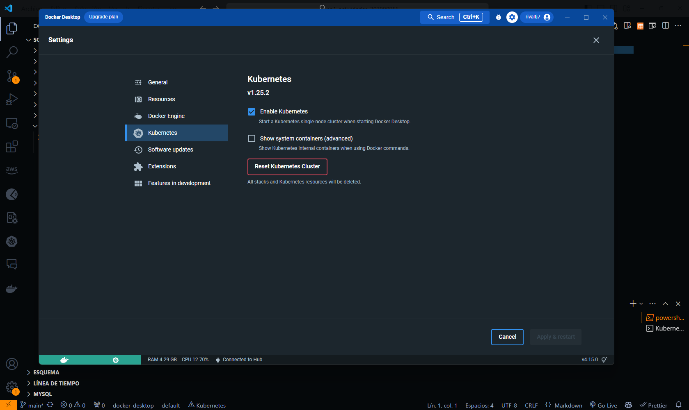
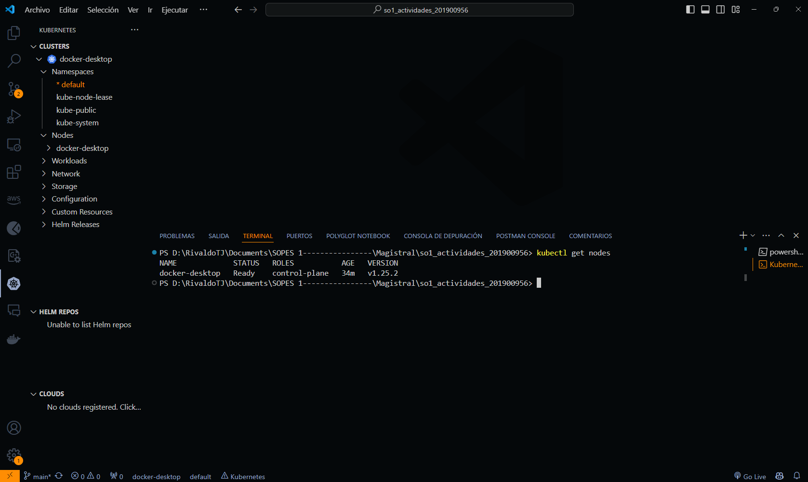
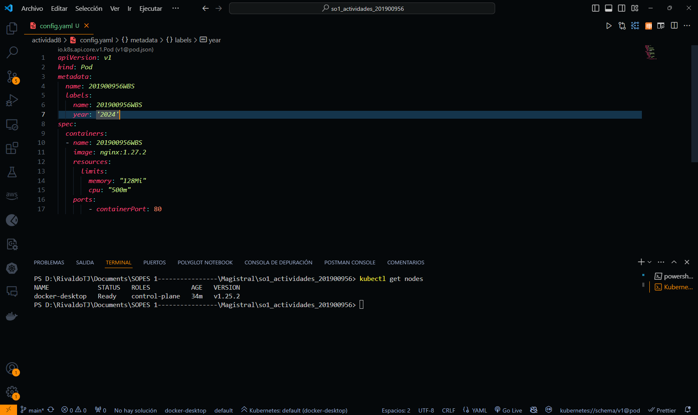
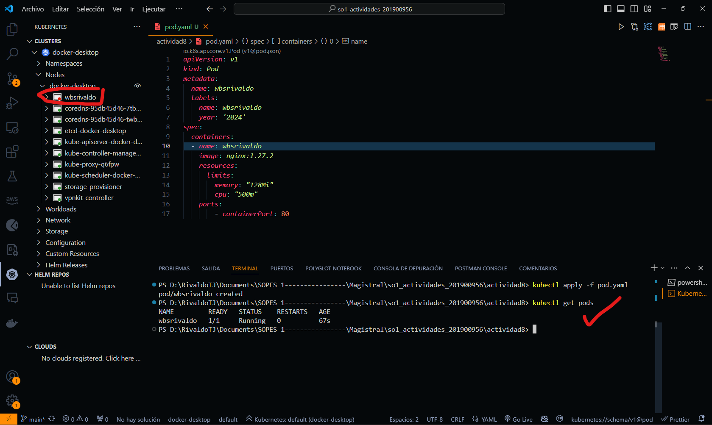
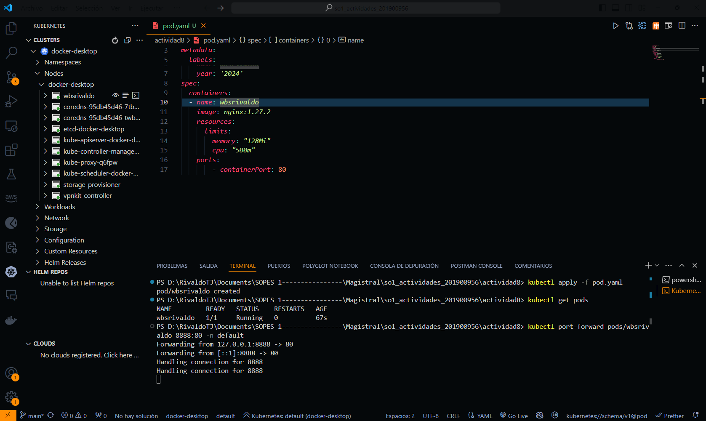
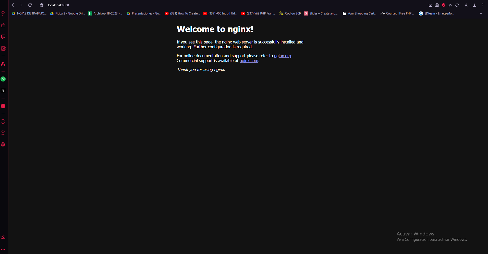
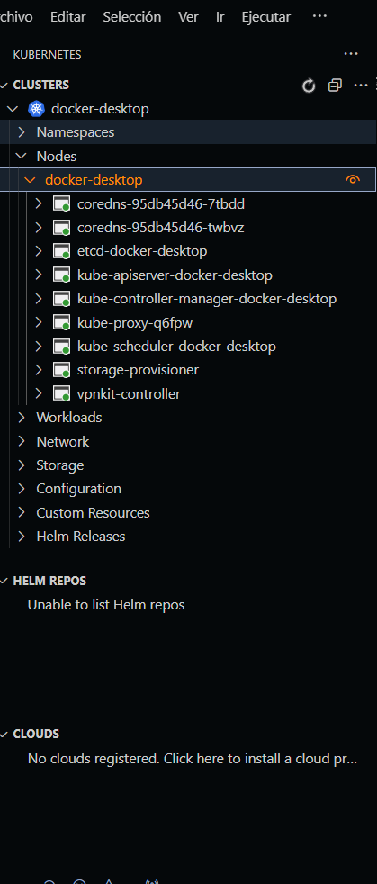

# Actividad 8 – Primeros pasos con K8s

## 1. Instalar un ambiente local de Kubernetes utlizando minikube, kind o Docker Desktop.

Se instalo en docker desktop, se puede ver en la siguiente imagen:

<p align="center">
  
  
</p>


## 2. Desplegar un contenedor de algun web server, apache o nginx por ejemplo, en el Cluster de K8s Local.

Se crea el archivo de configuración del deployment de nginx, se puede ver en la siguiente imagen:

<p align="center">
  
</p>

Se ejecuta el comando para desplegar el deployment de nginx, se puede ver en la siguiente imagen:

```bash
kubectl apply -f nginx-deployment.yaml
```



Se desplego un contenedor de nginx, se puede ver en la siguiente imagen:



Se ejecuta el comando para exponer el deployment de nginx, se puede ver en la siguiente imagen:

```bash
kubectl expose deployment nginx-deployment --type=NodePort --port=80
```




## 3. Contestar a siguiente pregunta.

### ¿En un ambiente local de Kubernetes existen los nodos masters y workers, como es que esto funciona?

Usualmente esto se ve en el ambiente de Minikube o K3s donde se tiene un solo nodo que actua como master y worker, pero en un ambiente de producción se tiene un nodo master que es el que controla el cluster y los nodos workers que son los que ejecutan las aplicaciones y servicios.

Los nodos masters, son lo que controlan el cluster, se encargan de la orquestación de los contenedores, la programación de los pods, la escalabilidad de los contenedores, la actualización de los contenedores, la configuración de los contenedores, la monitorización por lo que se puede decir que es el cerebro del cluster.

Los nodos workers, son los que ejecutan las aplicaciones y servicios, se encargan de la ejec

Pero en un ambiente local de Kubernetes, se tiene un solo nodo que actua como master y worker, por lo que se tiene un solo nodo que controla y ejecuta las aplicaciones y servicios.

imagen de referencia:
<p align="center">  </p>